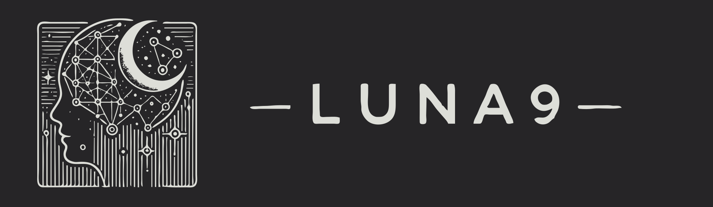

# Persona - Intelligent User Memory



**The memory layer for the next generation of intelligent agents.**

[](https://www.python.org/downloads/)
[](https://opensource.org/licenses/MIT)
[](https://docs.buildpersona.ai)

## 📚 Documentation

- **Official Docs**: [docs.buildpersona.ai](https://docs.buildpersona.ai)
- **Deep Dive**: [The Philosophy of Persona (saxenauts.io)](https://saxenauts.io/blog/persona-graph)
- **Quick Start (v0.3)**: [`docs/QUICK_START_V03.md`](docs/QUICK_START_V03.md)
- **Release Notes (v0.3)**: [`docs/RELEASE_NOTES_V03.md`](docs/RELEASE_NOTES_V03.md)

---

## Why Persona?

Memory in AI today is often treated as simple storage—a static database of vectors or JSON blobs. Tools like **Mem0** and **Graphiti** provide excellent infrastructure for this, handling the "storage" aspect efficiently.

But true intelligence requires more than storage. It requires a dynamic, living system that evolves with the user.

**Persona aims to be that intelligent layer.**

- **Beyond Storage**: Just as OpenRouter revolutionized model access by adding intelligence on top of raw APIs, Persona adds intelligence on top of raw memory.
- **Memetic Organism**: We view the user's digital identity not as a table of rows, but as a living graph—a "memetic organism" that grows, forgets, and reinforces connections based on interaction.
- **Intelligent Features**:
  - **Associative Recall**: Like the human mind, retrieving one memory triggers related ones through graph connections.
  - **Narrative Continuity**: Automatically links events in temporal chains to understand "stories", not just facts.
  - **Psychological Profiling**: Explicitly models "Psyche" (traits, values) separate from "Episodes" (events).

## Features

- **Dynamic Knowledge Graph**: Automatically builds a graph from unstructured text.
- **Typed Memory System**: distinct `Episode`, `Psyche`, `Entity`, and `Note` nodes.
- **Temporal Chaining**: Narrative continuity for life-logging and long-term companions.
- **Context Retrieval**: Vector similarity + graph traversal for tool-based recall.
- **Structured Insights**: Ask questions and get JSON data, not just text.

---

## Benchmarks

Persona v0.3 includes critical bug fixes (H1-H5) and a canonical claim policy that separates audit-grade baselines from experimental slices:

| Metric | v0.3 Canonical Value | Scope | Claim ID |
|--------|----------------------|-------|----------|
| PersonaMem subset baseline | 65.3% | N=150, seeds 42/123/456 | A-001 |
| PersonaMem full single-seed baseline | 66.2% | N=589, seed 42 | A-002 |
| BEAM (10 abilities) baseline | 69.0% | N=100, seed 1 (`event_ordering=0%`) | A-004 |

**Key Improvements**:
- **Temporal bugs fixed**: H1-H5 bug fixes improve chronological reasoning
- **Claims governance hardened**: release and paper claims are constrained to canonical methodology + canonical claims table
- **Experimental slices retained as non-headline evidence**: paired 50Q/100Q findings are documented separately

**PersonaMem** benchmark framing and external reference baselines are documented in the [benchmark paper](https://arxiv.org/abs/2501.14260).

> **Note**: Audit-grade release headlines come from canonical claim rows A-001, A-002, and A-004.
> One previously published benchmark claim is intentionally deferred from v0.3 public release headlines.
> Experimental paired slices (50Q/100Q) remain non-headline and are documented in `docs/PERSONAMEM_EVAL_CANONICAL.md`.
> Canonical methodology: [release_artifacts/methodology.md](release_artifacts/methodology.md)
> Canonical claims table: [docs/CLAIMS_TABLE_V03.md](docs/CLAIMS_TABLE_V03.md)
> Canonical policy: [docs/METHODOLOGY_CANONICAL_V03.md](docs/METHODOLOGY_CANONICAL_V03.md)
> No new eval runs are included in this release program.
> In any metric mismatch, the canonical claims table is authoritative.

---

## Quick Start

### Backend Support
Currently, Persona supports **Neo4j** (via Docker) as the primary graph backend.
> 🚧 **Coming Soon**: We are actively working on decoupling the storage layer to support **Qdrant**, **FalkorDB**, and generic vector/graph stores.

### Installation

```bash
git clone https://github.com/saxenauts/persona.git
cd persona
```

Create a `.env` file:

```env
# Graph Database (Neo4j)
URI_NEO4J=bolt://localhost:7687
USER_NEO4J=neo4j
PASSWORD_NEO4J=your_secure_password

# AI Services (OpenAI - easiest setup)
LLM_SERVICE=openai/gpt-4o
EMBEDDING_SERVICE=openai/text-embedding-3-small
OPENAI_API_KEY=your_openai_api_key

# Server runtime
UVICORN_WORKERS=1
UVICORN_RELOAD=true
```

Start the stack:

```bash
docker compose up -d
```

Explore the API at `http://localhost:8000/docs`.

---

## Roadmap Core Themes

- **Intelligent Forgetting**: Decay mechanisms for irrelevant memories.
- **Agentic Updates**: Self-healing graph that corrects its own contradictions.
- **Real-time Context**: Streaming updates for low-latency personalization.
- **Cross-User Intelligence**: (Planned) Privacy-preserving shared insights.


## License

MIT License. See [LICENSE](LICENSE) for details.
